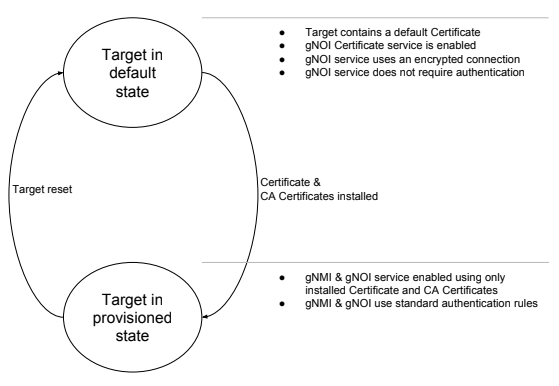

# Simplified Bootstrapping for gNOI and gNMI

Updated: April 1st, 2019

Version: 0.1.0

### Definitions

*   Client is the same as defined in gNMI
*   Target is the same as defined in gNMI
*   gNOI [Certificate Management service](../cert/cert.proto)
*   Secure connection - Encrypted and authenticated connection

### Bootstrapping

The gNOI Certificate Management service has the methods to install certificates
in the Target. But how does a Client use gNMI and gNOI to configure or operate a
Target, when the Target has not been given the state and trust to be able to
establish a secure connection in the first place?

## Bootstrapping with the gNOI Certificate Management service

When having a Target with no pre existing certificates, this method allows
installing certificates by using the gNOI Certificate Management service.
Following this installation the Target is then capable of establishing secure
gNOI/gNMI connections. This process assumes a pre-existing secure environment.
It is therefore more applicable to be used in build rooms, labs or properly
secured management networks.

### Bootstrapping conditions

Because the Target is not trusted, it is assumed that this bootstrapping process
happens in a secure environment. This implies that there is negligible chance of
man-in-the-middle attacks between the Client and the Target during this process.
In addition, it is assumed that the Target is not already compromised.

### Target state

A Target is defined as being in either the **default state** or the
**provisioned state**:

#### Target in default state

As in factory reset or unprovisioned state. When in this state, the Target must
provide a method for enabling the gNOI Certificate Management service if not
already enabled. In addition, the gNOI Certificate service must allow
unauthenticated connections. However, encryption should always be used, for this
a default certificate is employed. It is during this state the Client installs
the Target certificate and CA certificates bundle in the Target.

##### Enable gNOI Certificate Management service

The gNOI Certificate Management service must be enabled via one of the following
options:

1.  Already enabled by default;
2.  Triggered to run via DHCP third party attribute;
3.  Triggered to run via a compressed configuration downloaded from a location
    passed by a DHCP attribute;

The definition of such ZTP mechanisms are out of the scope of this document.

##### Unauthenticated session

Unauthenticated gRPC sessions are allowed in the default state. This is required
as the Target would have no way to validate the Client’s certificate as it has
no CA certificates.

##### Encryption

Encryption is always required as it raises the bar for potential attackers. As
such, in the default state, the Target should have and use a default
certificate. This certificate should be used only in the default state.
Resetting the Target to the default state always generates a new default
certificate or reuses a default one.

##### Certificate ID

The first installed certificate and CA certificate pool is used for the gNOI and
gNMI services. No other certificates should be installed during the default
stage. The certificate ID specified, becomes the associated certificate ID for
the gNMI/gNOI service.

##### Target behaviour

The Target must restart its gNOI/gNMI service and exclusively perform secure
connections as soon as the certificate and CA certificates have been
successfully installed, thus transitioning from the default state to the
provisioned state. The previously used default certificate must not be used once
in the provisioned state.

##### Client behavior

The Client, when bootstrapping a Target must not attempt to authenticate the
Target when establishing a connection. However it should still encrypt that
connection.

#### Target in provisioned state

When the Target is in provisioned state, the standard gNMI/gNOI authentication &
encryption rules apply.

#### Target reset

It must be possible to reset a Target to its default state. For a Network
Element this would be a factory reset triggered via gNOI. When executed, all
certificates and CA certificates should be cleared. A default certificate must
be generated if it does not already exist. The entire bootstrapping process
should be applicable again.
