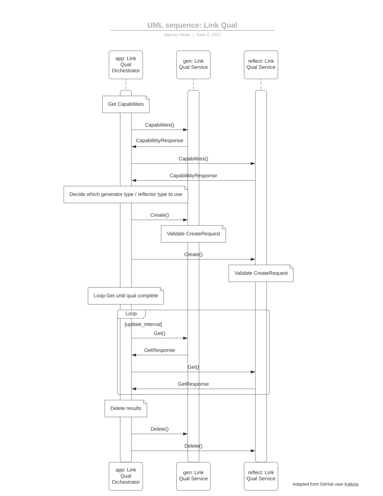
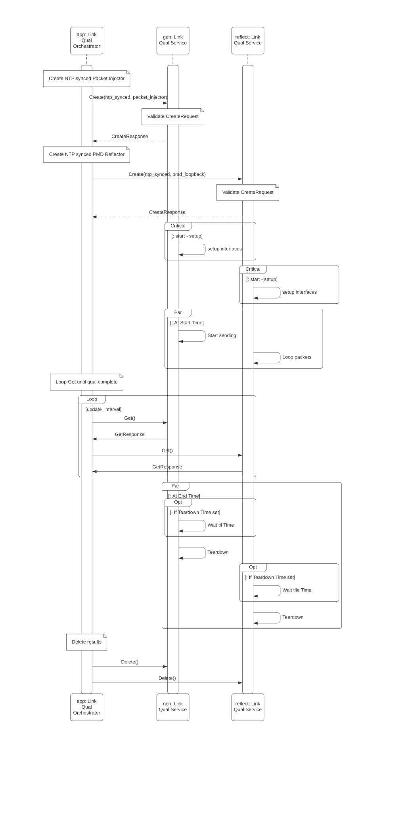

# Link Qualification Service v2 Definition

## Background

The link qualification service provides a way to certify link
quality on two devices. This service defines a protocol for setting up the peer
devices to allow for the generation of packets from one device to another and
validate those packets are sent and received, then restoring the devices to
their previous state. This service's intent is to allow for different
generation and reflection modes of operation based on the hardware capabilities
of the device. There is a standard report generated regardless of modes
selected and that common report can be used by upstream services to aggregate
network wide link quality.

## TLDR

### General flow



### Specific requirements around the service

#### Connectivity to devices during link qualification maybe interrupted

Upon calling Create, the interfaces on the device will be put into a forwarding
mode which must not contain other traffic, control or data. This may cause the
generator or reflector endpoint to become unreachable.  The service
implementation must gracefully handle this state.

**Devices must return to pre-link qualification state after the link qualification has completed or errored**

The service is not expected to persist state across reboots of the device.
Since no state is changed in the configuration of the device, on boot the
system should boot normally and there will be no side effects left from
previous link qualifications.

During the link qualification the device must put the interfaces into a
`TESTING` `oper-status` for the duration of the qualification. Once complete,
the `oper-status` should be restored to the previous state.

##### Devices must garbage collect results after some period to keep from filling up storage on the device

The service should store at least 2 qualification results for each interface.
The results are not expected to persist across reboots of the device.

##### The service implementation must support multiple generations of forwarding hardware which have different capabilities with regards to both generation and reflection of packets

* Packet Generators  
The preferred method for the generation of frames for the link qualification is
via a packet generator. This mode provides the most flexibility around packet
rates, packet sizes and packet content.

* Packet Injectors  
To support hardware which doesn't have a built in packet generator, link
qualification provides a packet injector mode to support a loop between both
endpoints in the qualification for packets to be injected and looped.

* ASIC Loopback  
The ASIC loopback mode allows for the loopback of frames to happen in the
forwarding path of the device.  This enables the most comprehensive testing
results as all counters should be available to the qualification.  This is the
preferred mode of reflection.

* PMD Loopback  
For devices which cannot implement an ASIC based loopback. The PMD loopback
mode can be supported.  This mode allows for the interface to be looped back at
either the PMD or in the interface.  This will likely limit what counters are
available for results on the reflector but can still validate the link.

## Service Definition

See [proto](packet_link_qualification.proto) for rpc and message definitions.

### Capabilities

Capabilities returns the endpoint types the device is able to support for link
qualifications.

### Create

Create will create the linkqualifcations for the provides interfaces on the
device. The provided configurations specific the id to be used by the qualifcation
as well as the endpoint type to be used.

### Delete

Delete will delete the qualifiction id from the device. If the qualifcation is not
in `QUALIFICATION_STATE_ERROR` or `QUALIFICATION_STATE_COMPLETED` the qualification
will be cancelled and torn down and deleted.

### Get

Get returns the current status and results for the provided qualfication id.

### List

List returns the list of all current and previous qualifications on the device.

## Use Cases

### Duplicate test ID called

* Create with config.id=”Test1” for interface Ethernet1
* While the above is still ongoing, Create with config.id=”Test1” for interface Ethernet2
* Second call to Create will return `AlreadyExists` error code within the gRPC error
    response.

### Existing Qualification running on interface

* StartPacketQualification with config.id=”Test1” for interface Ethernet1
* After the above is completed, StartPacketQualification with config.id=”Test1” for interface Ethernet2
* Second call to Create will return AlreadyExists error code

### Duplicate id but called after previous id is deleted

* Create with config.id=”Test1” for interface Ethernet1
* Delete with id=”Test1”
* Create with config.id=”Test1” for interface Ethernet2
* Second call to StartPacketQualification is expected to go through without errors.

### How a based generator walks through setting itself up

* Create call is made
* For all status errors described below are part of the individual qualification status
    and not part of the RPC status.
* Service validates the `interface_name` is valid
  * if not return `INVALID_PARAMETER`
* Service validates the `interface_name` is found
  * if not return `NOT_FOUND`
* Service validates the test id doesn't conflict with existing tests
  * if not return `ALREADY_EXISTS`
* Service validates the endpoint type is supported
  * if not return `INVALID_PARAMETER`
* Service validates endpoint configuration
  * if not return `INVALID_PARAMETER`
  * status should return what parameters are invalid
* If the synchronization mode is NTP
  * Validate that the service can start at that time it must be at least endpoint type setup time + current time away
  * if not return `INVALID_PARAMETER`
  * Mark status as `QUALIFICATION_STATE_IDLE`
  * Wait for `start_time` - `min_setup_time`
  * Begin Setup
    * Mark status as `QUALIFICATION_STATE_SETUP`
    * if the setup cannot be completed before `start_time`
      * Mark status as `QUALIFICATION_STATE_ERROR`
  * Begin Qualification at `start_time`
  * Start the qualification run for duration providing updates to the result every `min_sample_interval`
    * Mark status as `QUALIFICATION_STATE_RUNNING`
  * Wait for `end_time`
    * Mark status as `QUALIFICATION_STATE_TEARDOWN`
  * If `teardown_time` is set
    * Wait until `teardown_time`
  * Begin teardown
    * if the teardown cannot be completed
      * Mark status as `QUALIFICATION_STATE_ERROR`
  * Mark status as `QUALIFICATION_STATE_COMPLETED`
* if the synchronization mode is RPC
  * Validate the synchronization parameters for setup / teardown
  * If any errors have occurred
    * Mark status as `QUALIFICATION_STATE_ERROR`
  * if any failures occur during the following steps also mark status as `QUALIFICATION_STATE_ERROR`
  * Mark status as `QUALIFICATION_STATE_IDLE`
  * Mark status as `QUALIFICATION_STATE_SETUP`
  * Wait for `pre_sync_duration`
  * Start the setup for the setup
    * if the setup cannot be completed in `setup_duration`
      * Mark status as `QUALIFICATION_STATE_ERROR`
  * Once setup, wait for any remaining time based on the setup
  * Start the qualification run for duration providing updates to the result every `min_sample_interval`
    * Mark status as `QUALIFICATION_STATE_RUNNING`
  * Mark status as `QUALIFICATION_STATE_TEARDOWN`
  * Wait for `post_sync_duration`
  * Begin teardown
    * Mark status as `QUALIFICATION_STATE_TEARDOWN`
    * if the teardown cannot be completed in `teardown_duration`
      * Mark status as `QUALIFICATION_STATE_ERROR`
  * Wait for the remaining `teardown_duration`
  * Mark status as `QUALIFICATION_STATE_COMPLETED`

### Call graph for NTP synchronization



### Call example for RPC synchronization with packet injector and PMD loopback

* Caller gets Capabilities
  * generator supports:

```
message PacketInjectorCapabilities {
  min_mtu: 64
  max_mtu: 1500
  min_injected_packets: 1
  max_injected_packets: 1000
  min_setup_duration: "30s"
  min_teardown_duration: "30s"
  min_sample_interval: "60s"
  loopback_modes: PACKET_INJECTOR_LOOPBACK_MODE_PMD
}
```

* loopback supports:

```
message PmdLoopbackCapabilities {
  min_setup_duration: "10s"
  min_teardown_duration: "10s"
}
```

* Caller calculates the `pre_sync_duration`, `setup_duration`, `teardown_duration` and `post_sync_duration` for each side
  * **This assumes that both rpc's are sent in parallel**
  * Generator
    * `pre_sync_duration` = 10s
      * remote setup time so we know the loopback is ready for us to generate packets
    * `setup_duration` = 30s
      * Setup time desired for this endpoint type.  cannot be less than `min_setup_duration` provided as a capability.
      * Start sending packets
    * `duration` = 180s
      * qualification duration
      * stats must be updated every `min_sample_interval`
    * `post_sync_duration` = 0s
      * Generators should not need to set this value but may for synchronization issues with remote sides.
    * `teardown_duration` = 30s
      * The generator side teardown duration
      * The `min_teardown_duration` will be used if left unset
  * Reflector
    * `pre_sync_duration` = 0s
      * Loopbacks should not need to set this value but may for synchronization issues with remote sides.
    * `setup_duration` = 40s
      * This value should be the sum of the remote `setup_duration` and the local `min_setup_duration`. This value allows for the sides to be synchronized at the qualification start.
    * `duration` = 180s
      * qualification duration
      * stats must be updated every `min_sample_interval`
    * `post_sync_duration` = 30s
      * the reflector side should hold up the loopback until the remote side has finished teardown
    * `teardown_duration` = 10s
      * The reflector side teardown duration
      * The `min_teardown_duration` will be used if left unset
* Call generator and reflector Create()
* On the device acting as the Generator (PacketInjector)
  * Validate that `setup_duration` is >= `min_setup_duration`
  * Validate that `teardown_duration` is >= `min_teardown_duration`
  * Schedule the work with backend which should being with waiting for `pre_sync_duration` if set
  * Once the `pre_sync_duration` duration is reached
    * Begin putting interface into generator mode
    * If `setup_duration` has not been reached wait for the remaining duration
  * Take first snapshot of packets and rates for the initial result
  * Repeat taking snapshots of results every `min_sample_interval`
  * Once duration is reached wait for `post_sync_duration` if set (for generators this value is not expected to be set)
  * After `post_sync_duration` is reached begin teardown
* Reflector (PmdLoopback)
  * Validate that `setup_duration` is >= `min_setup_duration`
  * Validate that `teardown_duration` is >= `min_teardown_duration`
  * Schedule the work with backend which should being with waiting for `pre_sync_duration` if set (for reflector this value is not expected to be set)
  * Once the `pre_sync_duration` duration is reached
    * Begin putting interface into reflector mode
    * If `setup_duration` has not been reached wait for the remaining duration
  * Take first snapshot of packets and rates for the initial result
  * Repeat taking snapshots of results every update\_interval
  * Once duration is reached wait for `post_sync_duration` if set
  * After `post_sync_duration` is reached begin teardown

### Call graph for Mixed synchronization generator RPC / loopback NTP

* Caller gets Capabilities
  * generator supports:

    ```
    message PacketGeneratorCapabilities {
      max_bps: 250000000000
      max_pps: 200000000
      min_mtu: 64
      max_mtu: 9216
      min_setup_duration: "2s"
      min_teardown_duration: "2s"
      min_sample_interval: "1s"
    }
    ```

* loopback supports:

  ```
  message PmdLoopbackCapabilities {
    min_setup_duration: "10s"
    min_teardown_duration: "10s"
  }
  ```

* Caller calculates the `pre_sync_duration`, `setup_duration`, `teardown_duration` and `post_sync_duration` for each side
  * **This assumes that both rpc's are sent in parallel**
  * Generator

    ```
    message NTPSyncedTiming {
    start_time: time.Now()+"60s"
    end_time: time.Now()+"180s"
    }
    ```

    * `start_time`
      * adding 60 secs just to show how to balance out the loopback side via RPC
    * `end_time` = `start_time` + "180s"
      * qualification duration
      * stats must be updated every `min_sample_interval`
    * `teardown_time`
      * left unset as we want to the generator to teardown immediately after `end_time`
  * Reflector
    * `pre_sync_duration` = 0s
      * Reflectors should not need to set this value unless the RPC's are dispatched synchronously.
    * `setup_duration` = 60s
      * This value should be the sum of the remote `setup_duration` and the local `setup_duration`. This value allows for the sides to be synchronized at the qualification start.
    * `duration` = 180s
      * qualification duration
      * stats must be updated every `min_sample_interval`
    * `post_sync_duration` = 2s
      * the reflector side should hold up the loopback until the remote side has finished teardown
    * `teardown_duration` = 10s
      * The reflector side teardown duration
      * The `min_teardown_duration` will be used if left unset
* Call generator and reflector Create()
* Generator
  * Validate that `start_time >= time.Now() + min_setup_duration`
  * if `teardown_time` is set
    * `teardown_time` must be >= `end_time`
    * If not, `teardown_time` will be `end_time`
  * Begin setup at `start_time` - `min_setup_duration`
  * Take first snapshot of packets and rates for the initial result
  * Repeat taking snapshots of results every `min_sample_interval` until `end_time`
  * if `teardown_time` is not set, begin teardown.
    * if set wait until `teardown_time` then begin teardown
  * Once the teardown is complete, take the final reading on `packets_sent`, `packets_received`, `packets_error` and `packets_dropped` at the Generator end.
    *  `qualification_rate_bytes_per_second` counter should be computed only during the test duration using the bytes sent in the `min_sample_interval`. 
* Reflector
  * Validate that `setup_duration` is >= `min_setup_duration`
  * Validate that `teardown_duration` is >= `min_teardown_duration`
  * Schedule the work with backend which should being with waiting for `pre_sync_duration` if set (for reflector this value is not expected to be set)
  * Once the `pre_sync_duration` duration is reached
    * Begin putting interface into reflector mode
    * If `setup_duration` has not been reached wait for the remaining duration
  * Take first snapshot of packets and rates for the initial result
  * Repeat taking snapshots of results every `update_interva`l
  * Once duration is reached wait for `post_sync_duration` if set
  * After `post_sync_duration` is reached begin teardown
  * Once the teardown is complete, take the final reading on `packets_sent`, `packets_received`, `packets_error` and `packets_dropped` at the reflector end.
    *  `qualification_rate_bytes_per_second` counter should be computed only during the test duration using the bytes sent in the `min_sample_interval`.

### Workflow for Delete in the case of canceling early

* A caller may want cancel a running qualification early due to several administrative reasons
  * Noticing the errors have already exceeded a threshold
  * Wanting to change the rate or mtu for a running test
  * Canceling it as might have been scheduled at the wrong time
* The expectation would be that calling delete before completion would cause the service to immediately cancel the packet ongoing test by
  * Setting the status into `QUALIFICATION_STATE_ERROR`
  * The status would be `CANCELLED` in the embedded status message
  * The service would immediately start a teardown on the qualification
  * Once the qualification is torn down the results would be deleted.

## Future work

### Inband signaled link qualification

Using this API as a general purpose framework, it could be extended to support
an inband signaled mode of operation. In the currently defined implementations
the calling service must orchestrate both ends of the link via create / get /
delete calls.  An inband version could allow the caller to only need to
orchestrate the one side of the link. Also there could even be internal use
cases in which the devices themselves could initiate a link qualification
without external prompting.

### Link round-trip or one-way latency measurements

Some service providers use measured link round trip or one way latency as part of their
qualification process for link turn-up, often by comparing such values with those the
circuit design predicts. For example, this informs us whether the path was built on
“the correct side of the mountain”. A generator could be defined that passes timestamps
in-band in both directions that the devices at the ends of the link under test would
interpret to produce the round trip and potentially the one-way delay timing.
