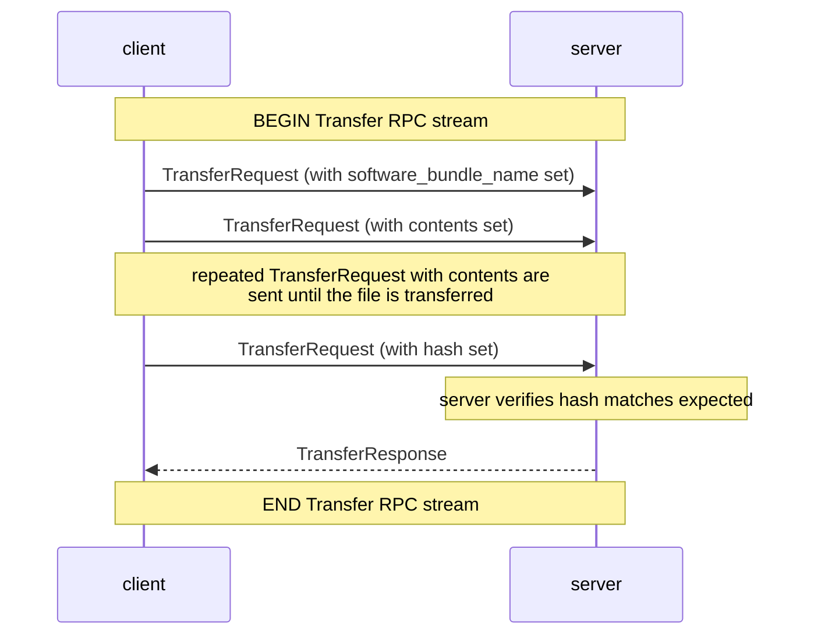
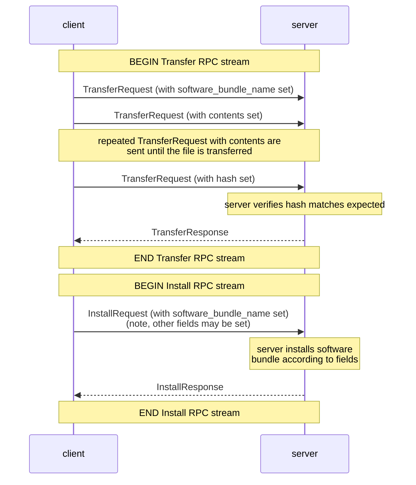
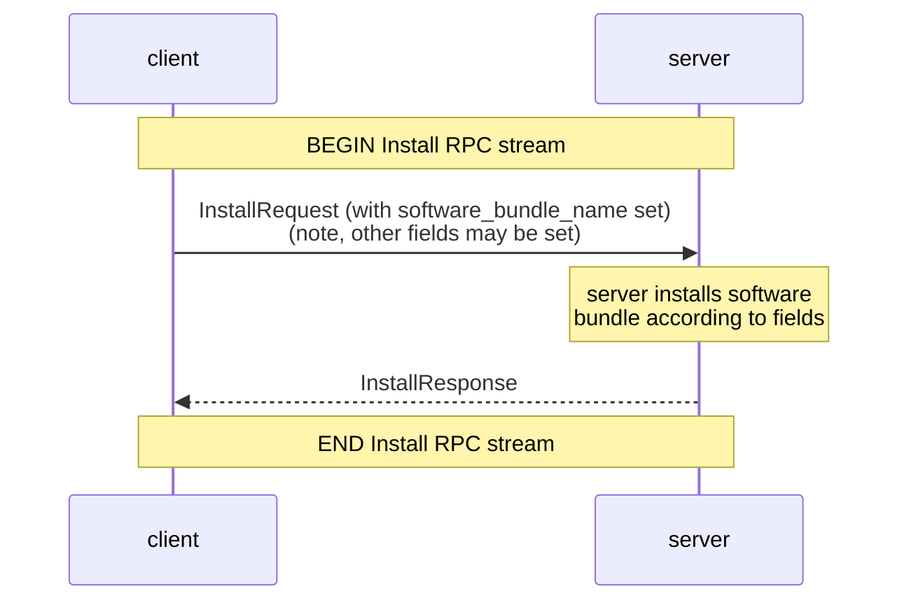

### Software bundle management

#### What is a software bundle?
A software bundle is a single file (e.g. RPM, squashfs, zip) which can be installed
on the system to extends the functionality of the system in some way.   
A software bundle may be installed to:
- fix some bug/CVE on the system, by updating the programs affected by that
  bug/CVE
- add a new feature to the system
- add/update some software utility (e.g. perl, ncurses)
- update some dependency (e.g. updating some python site-package)

A software bundle should have a unique name, which RPCs will use to refer to it.    
If network operators wish to have multiple versions of the same software bundle
coexisting on the system (and activate only one version at a time), they could
generate a unique name by appending the version into the name. 

### Software bundle installation workflow

#### 1. Software bundle Transfer
Optionally transfer the software bundle file to the system, or select a
software bundle which had been previously transferred but which was not installed.

#### 2. Software bundle Installation
Install the software bundle.
Optionally:
- set the signature verification option.
  This signature verification guarantees that the software bundle is unaltered
  after being signed, and that it originates from some trusted source.   
  Either:
  - ignore signature verification for this software bundle
  - accept software bundle signatures which are cryptographically signed by the switch vendor
  - accept software bundle signatures which are signed by some trusted certificates (specified on-device).
  
- mark the software bundle as a software bundle which should be applied on boot.   
  When the system reboots, it should apply the software bundle from boot.
- ignore any dependency issues.    
  (e.g. a later software bundle may be installed which would provide the correct
  dependencies)

Programs which are running will not be affected by the newly installed
software bundle, and will need to be reloaded before any changes take effect.    
E.g. if a software bundle contains a bug fix for OpenConfig, then this bug fix
will not be applied until OpenConfig is reloaded

(optionally) multiple software bundles can be installed in sequence, to minimise
the amount of times we have to reload affected programs

The following workflows for installation are expected:

1. To transfer a new software bundle:


2. To transfer and install a new software bundle:


3. To install a pre-existing software bundle:


#### 3. Process reload

Once any required software bundles are installed, the system needs to restart any
currently-running processes which would be affected by those software bundles.
When those processes reload, they will reload with the software bundles applied.

This restart be done with the `Activate` RPC


#### 4. Cleanup

To uninstall a software bundle, run the Deactivate RPC.
To cleanup the originally-transferred software bundle from disk,
run the Remove RPC.

### Comparison to existing SetPackage RPC

Right now SetPackage is
```protobuf
 // SetPackage places a software package (possibly including bootable images)
  // on the target. The file is sent in sequential messages, each message
  // up to 64KB of data. A final message must be sent that includes the hash
  // of the data sent. An error is returned if the location does not exist or
  // there is an error writing the data. If no checksum is received, the target
  // must assume the operation is incomplete and remove the partially
  // transmitted file. The target should initially write the file to a temporary
  // location so a failure does not destroy the original file.
  rpc SetPackage(stream SetPackageRequest) returns (SetPackageResponse) {}
```
with
```protobuf

// Package defines a single package file to be placed on the target.
message Package  {
  // Destination path and filename of the package.
  string filename = 1;
  // Version of the package. (vendor internal name)
  string version = 4;
  // Indicates that the package should be made active after receipt on
  // the device. For system image packages, the new image is expected to
  // be active after a reboot.
  bool activate = 5;
  // Details for the device to download the package from a remote location.
  common.RemoteDownload remote_download = 6;
}

// SetPackageRequest will place the package onto the target and optionally mark
// it as the next bootable image. The initial message must be a package
// message containing the filename and information about the file. Following the
// initial message the contents are then streamed in maximum 64k chunks. The
// final message must be a hash message contains the hash of the file contents.
message SetPackageRequest {
  oneof request {
    Package package = 1;
    bytes contents = 2;
    types.HashType hash = 3;    // Verification hash of data.
  }
}

message SetPackageResponse {
}
```

### Comparisions with other gNOI RPCs

#### Comparison with the gNOI OS package:
The gNOI OS service is responsible for installing/activating/verifying new OS images.   
By comparison, the software bundle does not constitute a whole new OS image - it is
purely to extend the functionality provided by the *current* OS image.    
This SoftwareBundle service was introduced as there are nuances regarding software bundle
installation which cannot be captured by the OS service.

For example, an operator may want to transfer software bundles to a device ahead of a scheduled maintenance.
The transfer/installation may take a significant amount of time so it is operationally useful to decouple
the transfer/installation from the activation of the software bundle (i.e. the Activate RPC).     
In addition, software installation may require signature verification,
dependency checks and boot/system startup changes.

The software bundle service allows for the transfer/installation and activation workflow to be
spread over multiple RPCs (Install and Activate), which gives an
opportunity for a network operator to install multiple extensions in sequence,
verifying that they all succeed before finalizing and reloading the relevant processes.

Network operators may choose to use a software bundle instead of an OS image if they
wish to apply a more targeted change to the system's behaviour. E.g they may be able to
patch a bug or CVE without needing to qualify a new image for their device.
Additionally, network operators may wish to add features which are not available in any OS image,
and would always require a software bundle to install.   
For example, the containerz binary may be packaged as a software bundle:
https://github.com/openconfig/containerz/tree/4d2da9ba981e73031f49e0d27f5cc4a1755fc66f/packaging

#### Comparison with the current version of SetPackage:
Under `SetPackage`, a "package" is very loosely defined.    
From the comments like `SetPackageRequest will place the package onto the
target and optionally mark it as the next bootable image` or
`SetPackage places a software package (possibly including bootable
images)` or that the `Package.activate` field being set to true means that
`For system image packages, the new image is expected to be active
after a reboot.`   
this makes it seem that this RPC was intended to be used primarily for
transferring new bootable images to the system.

In 2019 the gNOI OS service was introduced, and when `SetPackage` was
pointed to as an alternative to adding a new service, the idea was
rejected based on SetPackage being too generic to capture the workflow:    
https://github.com/openconfig/gnoi/pull/19#issuecomment-479083625

The generic nature of SetPackage therefore means it could be seen as
potentially being used to handle software bundles.
However, the same case that was made for gNOI OS can be made here for Software bundles -
software bundle management is complex enough to deserve its own service and RPCs.

A workflow for installing a software bundle is more complex than
adding a file onto a system and either "activating" it or not.
- The system should be configured to do signature verification.      
  SetPackage has no concept of this.
- The installation may be performed with a software bundle which is currently
  present on the system.        
  SetPackage only offers the option to transfer and
  then either immediately activate, or leave the package on the system.
  If the package is left on the system then SetPackage does not offer
  any capability to ever interact with that package again.
- The network operator may need/want to install multiple software bundles
  before reloading all affected programs at once.   
  SetPackage doesn't have any mechanism for handling the reload/activation
  step separately.
- Activation may affect the gNOI service, if the program running
  the gNOI service needs to reload.      
  SetPackage doesn't have any expectation that the RPC could be interrupted
  due to activation.
- SetPackage allows for packages to be transferred to arbitrary locations
  on the filesystem, while this should be abstracted away from the client
  when installing software bundles to allow for the system to group all software bundle
  files under a single directory (the system shouldn't search its entire
  filesystem for software bundle files)

For generic filesystems operations network operators should use the gnoi.File RPCs,
and for more specialised workflows (e.g. an OS installation workflow, or a software bundle management workflow)
separate services like gNOI OS and gNOI SoftwareBundle can be used, so that each service can capture the nuances
of each particular use case. This helps overloading SetPackageRequest/SetPackageResponse
with a lot of extra fields to accommodate the nuances of all use cases.
